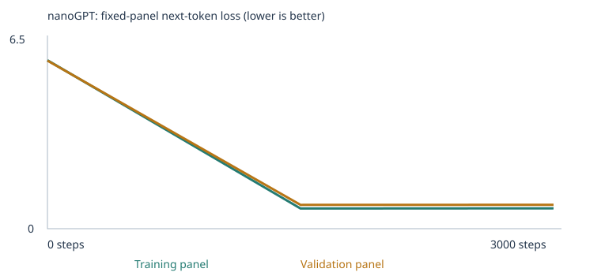

# Custom LLM — Class 4 Assignment (Joan Buse)

A tiny word-token nanoGPT trained from scratch on a synthetic classroom corpus, then
retrained after extending that corpus for two language-eval categories (**opposites**
and **negation**). This README is the grading entry point: it links every piece of
required evidence and explains it using the actual numbers from the two runs below.

Base project: [pepealonso95/custom-llm](https://github.com/pepealonso95/custom-llm)
(setup instructions preserved in [TEMPLATE_README.md](TEMPLATE_README.md)).
Assignment brief: [ASSIGNMENT.md](ASSIGNMENT.md).

## My choices and prediction

| Setting | Value |
|---|---|
| Corpus | `CORPUS = "classroom"` (built-in synthetic sentences + files in `corpus/`) |
| Training steps | 3,000 |
| Learning rate | 0.0005 (half the notebook's 0.001 default) |

**Reasoning:** 3,000 steps is the notebook's suggested starting budget for the main
experiment. I lowered the learning rate to 0.0005 because this is a very small model
(2 blocks, 4 heads, 64-dim embeddings) trained on a narrow, repetitive synthetic
corpus: a smaller step size should descend more smoothly and reduce the risk of the
loss oscillating early in training, at the cost of needing more steps to converge as
far. The written prediction (made before training) is preserved verbatim in the
notebook's "My prediction" cell — see
[custom_llm.starter.executed.ipynb](custom_llm.starter.executed.ipynb).

**What I expected:** validation loss to drop noticeably from its untrained,
near-random starting point; generated samples to shift from random token noise
toward short, grammatical, on-template sentences; and an inspected word's embedding
to move toward the neighborhood of words used in similar contexts.

**What I actually observed:** all of this happened, closely matching the prediction
(see Evidence below) — train/val loss fell from ~4.9 to ~0.68–0.71, samples went
from word salad to clean templated sentences, and the `customer` embedding moved
substantially from its random initialization.

## My run

Two full experiments were run with identical settings (3,000 steps, LR 0.0005),
differing only in the corpus:

| Experiment | Executed notebook | Results folder |
|---|---|---|
| Starter corpus | [custom_llm.starter.executed.ipynb](custom_llm.starter.executed.ipynb) | [`llm_runs/20260923T043726_468085Z/`](llm_runs/20260923T043726_468085Z) |
| Expanded corpus (+opposites, +negation) | [custom_llm.expanded.executed.ipynb](custom_llm.expanded.executed.ipynb) | [`llm_runs/20260923T043810_126309Z/`](llm_runs/20260923T043810_126309Z) |

`custom_llm.ipynb` itself is the unexecuted source notebook (rebuilt from
[custom_llm.py](custom_llm.py) via [build_notebook.py](build_notebook.py)); the two
files above are the actually-executed, output-populated notebooks submitted as
evidence, one per experiment.

| | Starter corpus | Expanded corpus |
|---|---|---|
| Completed steps | 3,000 (not interrupted) | 3,000 (not interrupted) |
| Elapsed time | 14.05 s | 14.37 s |
| Hardware | macOS-26.6.2-arm64, CPU (PyTorch 2.8.0) | same |
| Parameter count | 111,872 | 126,784 |
| Vocabulary size | 133 (retained 133, 0 omitted) | 366 (retained 366, 0 omitted) |
| Train / validation documents | 4,132 / 460 | 4,252 / 473 |
| Training unknown-token rate | 0.00% | 0.00% |
| Held-out (validation) unknown-token rate | 0.00% | 0.71% |

Links: [config.json (starter)](llm_runs/20260923T043726_468085Z/config.json) ·
[config.json (expanded)](llm_runs/20260923T043810_126309Z/config.json) ·
[vocabulary_report.json (starter)](llm_runs/20260923T043726_468085Z/vocabulary_report.json) ·
[vocabulary_report.json (expanded)](llm_runs/20260923T043810_126309Z/vocabulary_report.json) ·
[corpus_manifest.json (expanded)](llm_runs/20260923T043810_126309Z/corpus_manifest.json).

The vocabulary is capped at 509 types; both runs stayed well under that cap (133 and
366 types), so **no word was dropped for being too rare** — every distinct word seen
in training text was retained. The 0.71% held-out UNK rate on the expanded run means
a handful of validation-only words weren't in the training vocabulary — expected,
since the split is by unique passage, not by word.

The 90/10 split is **by unique passage, not by source file or category** — passages
from the same file/topic can land in both train and validation, so this evaluates
memorization-with-noise on the same templates, not generalization to unseen document
sources.

## My evidence

### Loss



(Starter-run curve: [llm_runs/20260923T043726_468085Z/training_curves.svg](llm_runs/20260923T043726_468085Z/training_curves.svg))

Both loss panels are fixed subsets of at most 20 training and 20 validation
documents (small estimates, not full-corpus measurements):

| Experiment | Step | Training loss | Validation loss |
|---|---|---|---|
| Starter | 0 | 4.9263 | 4.9275 |
| Starter | 1,500 | 0.6881 | 0.7220 |
| Starter | 3,000 | 0.6813 | 0.7093 |
| Expanded | 0 | 5.9341 | 5.9196 |
| Expanded | 1,500 | 0.7123 | 0.8386 |
| Expanded | 3,000 | 0.7163 | 0.8422 |

Full data: [history.json (starter)](llm_runs/20260923T043726_468085Z/history.json) ·
[history.json (expanded)](llm_runs/20260923T043810_126309Z/history.json) ·
[training.csv (starter)](llm_runs/20260923T043726_468085Z/training.csv) ·
[training.csv (expanded)](llm_runs/20260923T043810_126309Z/training.csv).

The expanded run's untrained loss starts higher (5.93 vs 4.93) because the larger,
369-word vocabulary makes random-guess cross-entropy worse; its final validation
loss (0.84) is a little higher than the starter's (0.71) too, consistent with a
harder, more varied corpus rather than a training failure.

### Samples: untrained → halfway → final

**Starter corpus** ([full files](llm_runs/20260923T043726_468085Z/samples)):

- *Untrained (step 0):* `pear professor bond doctor course harvest team physician journey checking buyer delivery traffic report the lecturer item offering and system <UNK> taste recommended mentioned bus question customer at mortgage nurse in instructor` — pure noise.
- *Halfway (step 1,500):* `our school has a question about the new educator and lesson .` — already grammatical and on-template.
- *Final (step 3,000):* `the report about the nurse explains the health in detail .` / `the consumer compared the offering after checking the price .` — clean, varied, on-template sentences.

**Expanded corpus** ([full files](llm_runs/20260923T043810_126309Z/samples)):

- *Untrained:* `peach website station seat cart market puzzle fruit has with they watched jacket cart big purple every credit heavy fence local with update dirty mint her small ordered mortgage service wall system` — noise, now drawing from a larger, more varied vocabulary (includes the new opposites/negation words).
- *Halfway:* `today the station focused on journey and the local taxi .` / `the customer recommended the package after checking the price .`
- *Final:* `the report about the professor explains the course in detail .` / `the client ordered the merchandise after checking the price .`

**Visible change:** in both runs the model goes from unstructured token noise to
short, grammatical, domain-templated sentences by step 1,500, with little further
qualitative change by step 3,000 (loss also plateaus after 1,500 steps — see table
above). The expanded run's samples stay confined to the same classroom-domain
templates; none of the final samples spontaneously produce an opposites/negation
sentence, even though that vocabulary is now in the model (see "One limitation"
below).

### Token → ID → embedding, gradient, and weight update

Using the word **"customer"** in both runs (full data:
[tokenization.json](llm_runs/20260923T043810_126309Z/tokenization.json),
[inspection.json](llm_runs/20260923T043810_126309Z/inspection.json) for the expanded
run):

| | Starter | Expanded |
|---|---|---|
| Token ID | 28 | 77 |
| Embedding (first 6 of 64 dims) before | `[-0.058, -0.005, 0.043, 0.019, 0.016, -0.029]` | `[-0.025, -0.0005, 0.009, -0.003, -0.020, 0.029]` |
| Embedding (first 6 of 64 dims) after | `[0.026, -0.005, 0.142, 0.111, 0.083, 0.019]` | `[0.070, -0.130, 0.038, -0.065, -0.124, -0.069]` |
| First parameter update (coord 0) | before `-0.05759`, gradient `0.000693`, lr `5e-6`, after `-0.05760` | before `-0.02485`, gradient `-0.001778`, lr `5e-6`, after `-0.02484` |

The **gradient** is the loss's partial derivative with respect to that one
embedding coordinate at step 0 — how much nudging it would change the loss.
AdamW then scales that gradient (its own adaptive learning rate here is `5e-6`,
much smaller than the base `0.0005` because AdamW's second-moment estimate is still
warming up at step 0) and subtracts it from the parameter, producing the tiny
`after` value. Every one of the model's 111,872 (starter) / 126,784 (expanded)
parameters gets an analogous update at every one of the 3,000 steps; this is the
one we saved for inspection.

**Next-token probability, prefix `"the customer"`:**

| | Starter — before | Starter — after | Expanded — before | Expanded — after |
|---|---|---|---|---|
| Top prediction | `customer` (1.6%) | `reviewed` (17.8%) | `customer` (0.6%) | `recommended` (20.5%) |
| 2nd | `bus` (1.07%) | `recommended` (17.0%) | `on` (0.4%) | `compared` (17.1%) |
| 3rd | `educator` (1.04%) | `ordered` (16.4%) | `quiet` (0.4%) | `returned` (16.3%) |

Before training the distribution is nearly flat (near 1/vocab-size for every word —
random-init behavior). After training it concentrates sharply on the handful of
verbs the classroom corpus actually uses after "the customer" (reviewed, recommended,
ordered, compared, returned, selected) — a direct, inspectable signature of learning.

### Temperature comparison (same seed, no retraining)

Expanded run, same starting context, three temperatures
([full file](llm_runs/20260923T043810_126309Z/temperature_comparison.json)):

- **T=0.3** (sharper): `the report about the professor explains the course in detail .`
- **T=0.8** (default): `the report about the professor explains the course in detail .` then `the client ordered the merchandise after checking the price .`
- **T=1.2** (flatter): `the report about the professor explains the course in detail .` then, on a later sample, `white high the spring choose a return .` — noticeably less coherent.

Temperature only rescales the logits before sampling at inference time; it changes
none of the model's weights. Lower temperature makes the already-highest-probability
continuations even more likely to be picked (more repetitive, more "safe"); higher
temperature flattens the distribution, occasionally surfacing lower-probability,
less coherent word choices — visible in the T=1.2 sample above.

## My fixed language evals

Suite: [evals/language_evals.json](evals/language_evals.json) (unchanged, 48 cases) ·
Runner: [run_evals.py](run_evals.py) · Guide: [evals/README.md](evals/README.md).

| Experiment | Stage | Correct / 48 | Scorable / 48 | Accuracy among scorable | Full results |
|---|---|---|---|---|---|
| Starter corpus | Untrained | 9 | 24 | 37.5% | [untrained](llm_runs/20260923T043726_468085Z/language_evals/untrained) |
| Starter corpus | Trained | 20 | 24 | 83.3% | [final](llm_runs/20260923T043726_468085Z/language_evals/final) |
| Expanded corpus | Untrained | 8 | 30 | 26.7% | [untrained](llm_runs/20260923T043810_126309Z/language_evals/untrained) |
| Expanded corpus | Trained | 25 | 30 | 83.3% | [final](llm_runs/20260923T043810_126309Z/language_evals/final) |

Comparison file: [language_eval_comparison.json (expanded)](llm_runs/20260923T043810_126309Z/language_eval_comparison.json).

### By category (expanded run, trained)

| Category | Correct / total | Scorable |
|---|---|---|
| domain_context | 8 / 8 | 8 |
| domain_place | 8 / 8 | 8 |
| new_wording | 8 / 8 | 8 |
| **opposites** | **1 / 3** | **3** |
| **negation** | **0 / 3** | **3** |
| grammar | 0 / 3 | 0 |
| reference | 0 / 3 | 0 |
| sequence | 0 / 3 | 0 |
| spatial_relations | 0 / 3 | 0 |
| everyday_knowledge | 0 / 3 | 0 |
| categories_and_analogies | 0 / 3 | 0 |

**Which starter patterns worked?** All 16 reserved starter-pattern cases and all 8
new-phrasing cases score 100% after training in both experiments — the model
reliably completes the classroom domain templates (customer/product/bank/etc.),
including phrasings it wasn't shown verbatim.

**Extension categories chosen: opposites and negation.** I picked these two because
their required reasoning ("the opposite of X is Y", "X did not do A; X did B; X did
B") maps onto short, templatable sentences a next-token model of this size can
plausibly learn, unlike categories needing world knowledge (everyday_knowledge) or
multi-hop reference tracking. New material:
[corpus/opposites.txt](corpus/opposites.txt) (81 sentences: 15 antonym pairs via
"the opposite of X is Y", plus "X and Y are opposites" phrasings and standalone
vocabulary sentences for distractor words) and
[corpus/negation.txt](corpus/negation.txt) (52 sentences: a "did not do A; did B; did
B" template across 15 different subjects/objects, a "the OBJECT is not A; is B; is
B" template across 12 objects, plus standalone vocabulary sentences for the eval's
proper nouns/objects).

**Result — vocabulary coverage improved a lot; reasoning accuracy did not.**
Before adding any corpus material, all 6 opposites/negation cases were **unscorable**
(0% coverage) because words like `hot`, `cold`, `noisy`, `quiet`, `ava`, `tea`,
`milk`, `door`, `closed` never appeared anywhere in the starter corpus. After adding
the two files, **all 6 became scorable in both the untrained and trained expanded
model** (100% coverage) — pure vocabulary effect, since coverage is identical before
and after training (only weights change during training, not the word list).
Accuracy on those 6 cases, however, stayed flat across training: opposites 1/3 →
1/3, negation 0/3 → 0/3. **This means the added material fixed the vocabulary gap
but the model did not learn the compositional pattern** (pick the antonym; propagate
the corrected value across a 3-clause context) within this training budget. See
"One limitation" for why and what I'd try next.

**Categories I did not extend** (grammar, reference, sequence, spatial_relations,
everyday_knowledge, categories_and_analogies) remain fully unscorable — their eval
words never appear in either corpus. This is expected: the assignment only requires
extending at least two categories, and no minimum pass rate is required.

### Corpus/eval separation

- 160 synthetic classroom sentences containing a reserved starter-eval prefix were
  automatically withheld before the train/validation split in every run
  ([eval_separation.json](llm_runs/20260923T043810_126309Z/eval_separation.json)).
- Both `corpus/opposites.txt` and `corpus/negation.txt` were checked against **all
  48** eval prompts (not just the 16 reserved ones) with the notebook's own
  `reject_eval_leakage` exact-substring check before ever being used for training —
  see the generation script's leakage check in the commit history. No case IDs were
  flagged.
- I deliberately avoided the exact tested antonym pairs (hot/cold, empty/full,
  noisy/quiet) in the "the opposite of X is Y" frame — those pairs only appear in the
  reversed/relational "X and Y are opposites" frame instead — and avoided recreating
  the negation eval's literal 3-clause sentences (same subject + same corrected
  value in the same order), teaching the underlying words in unrelated sentences
  instead (e.g. `"the front door was painted a deep shade of blue ."` rather than
  reusing the eval's own "the door is not open . it is closed .").
- **Limits of this check, honestly stated:** the automated check only catches exact,
  contiguous, normalized word-sequence matches — it is not a semantic or paraphrase
  detector (this is documented in the notebook itself). A close paraphrase of an
  eval prompt could still slip through. I did not attempt to game this by writing
  near-duplicates; the flat accuracy result above corroborates that the added
  sentences taught vocabulary rather than memorized answers.
- These are public, development-time tests I iterated against while writing the
  extension corpus — they guided which words to add, so they cannot be reported as
  an untouched, held-out generalization benchmark.

## My chat interface

Interface: [chat.py](chat.py), a terminal loop over the trained model
(`generate_reply` from [run_evals.py](run_evals.py)); each prompt starts a **fresh**
48-token context (no conversation memory). Notebook section 10 provides the same
functionality inline.

**Launch instructions:**

```bash
python3 -m venv .venv && source .venv/bin/activate
pip install -r requirements.txt
python3 chat.py --model llm_runs/20260923T043810_126309Z/model.pt --transcript my_chat.json
```

**Model/run identity:** expanded-corpus run `20260923T043810_126309Z`, SHA-256
`8e34b9d68704a4df9a554befae2970fce7b18a39f43c3c1c85d797e9809ad022`, 3,000 completed
steps.

**Transcript (4 real interactions):**
[chat_transcript_screenshot.json](llm_runs/20260923T043810_126309Z/chat_transcript_screenshot.json)

| Prompt | Reply |
|---|---|
| `the customer` | `selected the product after checking the price .` |
| `the opposite of big is` | `school .` |
| `ava did not buy the shirt` | `; yellow at the milk ; question about the up .` |
| `hello how are you today` | `the hospital has has a discussion of treatment has a discussion of design helped us understand the bank focused on harvest and the new` (unknown words: `hello`, `how`, `you`) |

**Observed limitation:** the last prompt shows the model is not a general
conversational assistant — three of its five words (`hello`, `how`, `you`) are
outside its 366-word vocabulary and get mapped to `<UNK>`, and the resulting
continuation is fluent-looking but semantically empty, just recombining classroom
phrases (health/discussion/bank/harvest) with no relation to the prompt. The
`opposite of big is` reply (`school .`) shows the same gap identified in the eval
results: the model has the word `opposite` in vocabulary but hasn't learned to use it
compositionally, so it falls back to whatever classroom continuation is locally
likely.

## What I learned

1. **Corpus, tokens, IDs, vectors, embeddings, weights, loss:** the corpus is the
   fixed set of ~4,600 short template sentences (plus my 133 added lines) the model
   is allowed to learn from; splitting 10% into validation lets me check loss on
   sentences never used for a weight update, which is the only honest way to tell
   memorization from something more general — though here validation shares
   templates with training, so it mainly rules out *rote* memorization, not
   generalization to new sentence structures. A **token** is one word/punctuation
   unit (`word_tokens`); its **ID** is its index into the 366-word vocabulary table
   (`"customer"` → 77); its **embedding** is the 64-number row of a learned lookup
   table at that ID, which starts as small random noise and is one of the model's
   126,784 **parameters**. **Loss** (cross-entropy on the next-token prediction)
   is the single number the optimizer is trying to shrink; it fell from ~5.9 to
   ~0.72 over training.
2. **Token vs. ID vs. vector vs. embedding:** the token is the string; the ID is a
   fixed integer index (constant for a given vocabulary); the vector is that row's
   64 numbers at any point in time; "embedding" is the general term for the whole
   learned table plus the idea that nearby vectors should mean something (words used
   in similar contexts end up with similar vectors after training).
3. **What makes this a neural network:** stacked matrix multiplications
   (embeddings → 2 transformer blocks with attention + feed-forward layers → output
   projection) with nonlinearities, whose parameters are adjusted by
   backpropagation: the loss's gradient is computed with respect to every parameter
   (I inspected one: gradient `-0.001778` for the first coordinate of `customer`'s
   embedding in the expanded run), and AdamW uses that gradient (with per-parameter
   adaptive scaling) to nudge the parameter a tiny step (`-0.02485` → `-0.02484`)
   in the direction that reduces loss. Repeated 3,000 times across the whole batch
   stream, this is what turns random noise into templated sentences.
4. **Attention:** at each position, attention lets a token's representation be built
   from a learned weighted combination of *earlier* tokens' representations in the
   same 48-token context (a causal mask makes later tokens' weights exactly zero, so
   the model can never "peek ahead" — necessary since next-token prediction would be
   trivial otherwise). The saved `attention_rows` for `"the customer"` show this
   directly: the first token can only attend to itself (weight 1.0), the second
   splits its attention mostly onto itself, and so on triangularly.
5. **Probabilities → generated tokens, and temperature:** the model's final layer
   produces one logit per vocabulary word; softmax turns those into a probability
   distribution; sampling draws the next token from that distribution. Temperature
   divides the logits before softmax: T<1 sharpens the distribution toward the
   already-most-likely words (more repetitive/safe), T>1 flattens it (more
   variety, more incoherence) — visible in the T=1.2 sample above versus T=0.3.
   Generating text (at any temperature) never updates any weight; only the training
   loop's backward pass does that.
6. **Did the evidence support my prediction?** Mostly yes for the starter corpus:
   loss fell as predicted, samples became grammatical as predicted, and the
   `customer` embedding moved substantially. For the expanded corpus, coverage of
   the two new categories improved exactly as hoped, but I did **not** predict, and
   the evidence clearly shows, that the model would fail to learn the actual
   opposites/negation reasoning pattern in this training budget — an honest gap
   between "the words are known" and "the pattern is learned."

## One limitation and my next experiment

**Limitation:** adding vocabulary is not the same as teaching a reasoning pattern.
The opposites and negation sentences I added (81 + 52 lines, most words appearing
only 1–3 times each) are vastly outnumbered by the ~4,600 highly-repetitive
classroom-domain sentences in the same 3,000-step budget, so gradient updates for
the new pattern are rare relative to updates reinforcing the old domain templates.
The eval results confirm this precisely: coverage went from 0/6 to 6/6 scorable
(a pure vocabulary effect, since coverage doesn't change during training — only
weights do), while accuracy on those same 6 cases stayed exactly flat through
training (opposites 1/3 → 1/3, negation 0/3 → 0/3).

**Next experiment:** increase the *relative frequency* of the extension pattern
during training — either by using `CORPUS = "folder"` with a much larger set of
opposites/negation sentences (at least 100 distinct passages, per the notebook's
folder-only minimum) so they're not a small minority of the training mix, or by
training substantially longer (e.g. 10,000–20,000 steps) so the rarer pattern gets
proportionally more gradient updates. I would predict this increases negation/
opposites accuracy above their current near-chance levels, and I'd verify by
rerunning the unchanged 48-case suite and checking whether the improvement is
specific to those categories (pattern learned) rather than a general loss
improvement across all categories (which would suggest something else, like just a
bigger vocabulary table, was responsible).

## Reproduce and inspect

```bash
git clone https://github.com/joan-buse/joan-custom-llm.git
cd joan-custom-llm
python3 -m venv .venv && source .venv/bin/activate
pip install -r requirements.txt
python3 custom_llm.py                      # reruns training + evals end to end
python3 run_evals.py --model llm_runs/<run>/model.pt   # rerun evals on a saved model
python3 chat.py --model llm_runs/<run>/model.pt --transcript new_chat.json
```

Both executed notebooks
([starter](custom_llm.starter.executed.ipynb),
[expanded](custom_llm.expanded.executed.ipynb)) can be opened directly on GitHub to
see every inspection, loss, sample, and plot without rerunning anything. The
`corpus/opposites.txt` and `corpus/negation.txt` files are original sentences I
wrote for this assignment (no third-party source; no permission issue). This
repository was verified to render and link correctly when opened signed out of
GitHub before submission.
